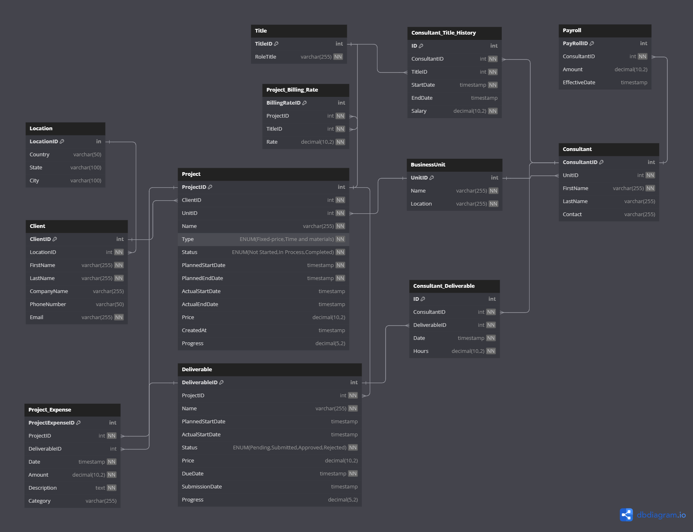

# ConsultingFirmDB Mockup

A comprehensive mock database system for a consulting firm with data generation, ETL processes, and reporting capabilities.

## Basic Setup
```
pip install -r requirements.txt
```

## Run Data Generation
- Windows: `python src\main.py`
- Mac/Linux: `python3 src/main.py`

## Configuration Options
- **Data Parameters**: Modify generation parameters in:
  - `src/config/consultant_settings.py`: Salaries, promotions, growth rates
  - `src/config/project_settings.py`: Project types, billing rates, team sizes
- **Output Paths**: Edit `src/config/path_config.py`
- **Timeframe**: Adjust `START_YEAR`, `END_YEAR`, and `INITIAL_CONSULTANTS` in `src/main.py`

## Snowflake Integration
1. Configure in `.env`:
```
SNOWFLAKE_ACCOUNT=your_snowflake_account
SNOWFLAKE_USER=your_user_name
SNOWFLAKE_PASSWORD=your_password
```
2. Run setup: `python src/etl_service/setup_snowflake_db.py`
3. Run migration: `python src/etl_service/sqlite_to_snowflake.py`

## Run All Components
Execute complete process (data generation → Snowflake setup → migration):
```
./run.sh
```

## Database Design

