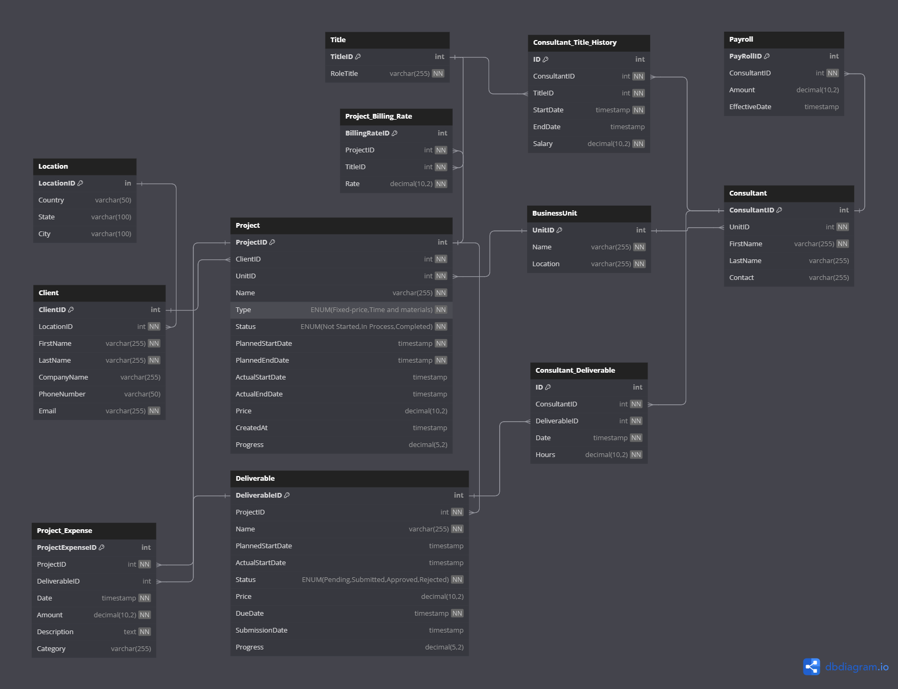

# Setup
run pip install -r requirements.txt
# Run Data Generation
Powersehll: python src\main.py\
Bash/Zsh: python3 src\main.py
# Run Data Migration
Use .env and store your snowflake account info:\
example:\
SNOWFLAKE_ACCOUNT=your_snowflake_account
SNOWFLAKE_USER=your_user_name
SNOWFLAKE_PASSWORD=your_password
python src\etl_service\setup_snowflake_db.py
# Database Design:

